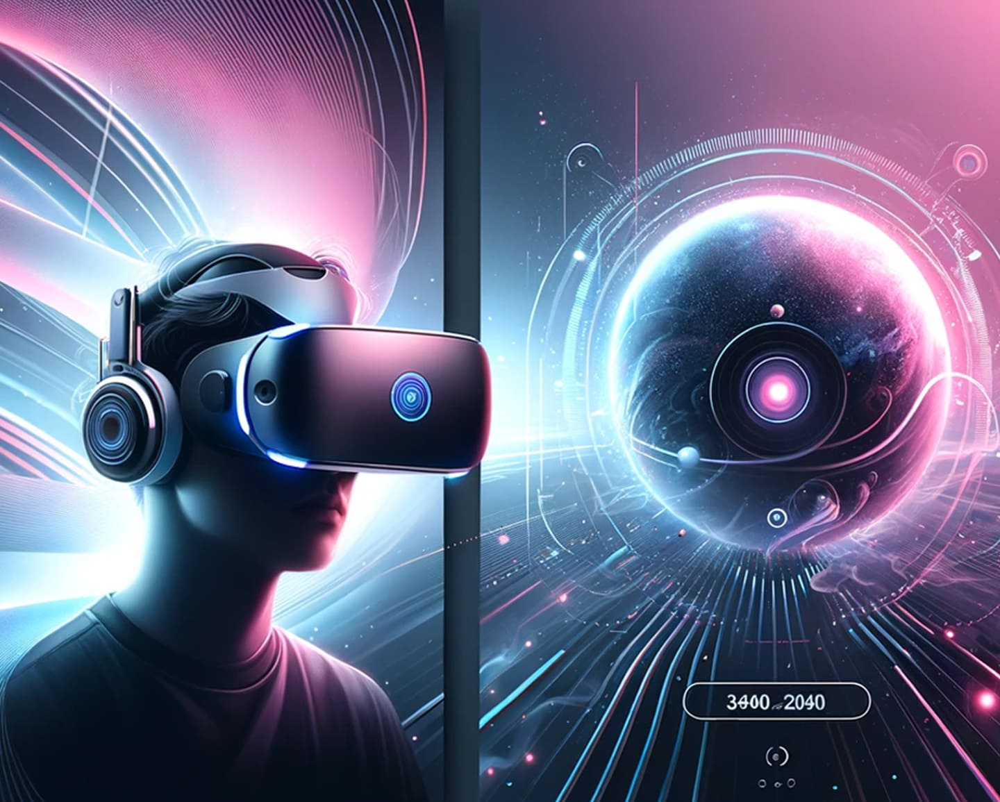
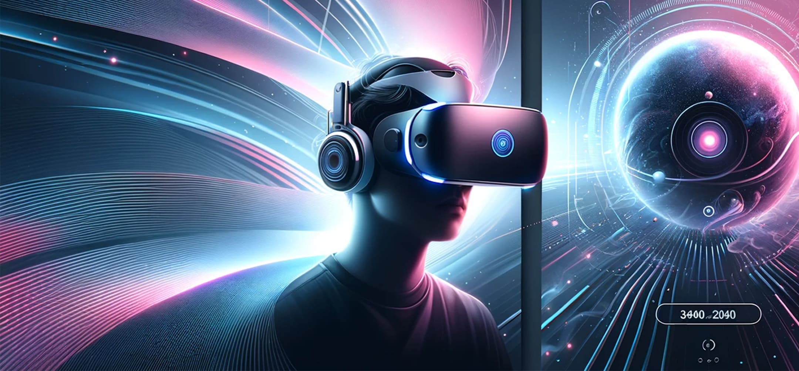

# 바닐라 JS 프로젝트 성능 개선

- url: https://front-5th-chapter4-2-basic-eta.vercel.app/

## 성능 개선 보고서

### 개선 전 성능 지표

1. 🎯 Lighthouse 점수

   | 카테고리       | 점수 | 상태 |
   | -------------- | ---- | ---- |
   | Performance    | 72%  | 🟠   |
   | Accessibility  | 82%  | 🟠   |
   | Best Practices | 75%  | 🟠   |
   | SEO            | 82%  | 🟠   |
   | PWA            | 0%   | 🔴   |

2. 📊 Core Web Vitals (2024)

   | 메트릭 | 설명                      | 측정값 | 상태 |
   | ------ | ------------------------- | ------ | ---- |
   | LCP    | Largest Contentful Paint  | 7.88s  | 🔴   |
   | INP    | Interaction to Next Paint | N/A    | 🟢   |
   | CLS    | Cumulative Layout Shift   | 0.011  | 🟢   |

### 개선 이유

1. 모든 성능 지표가 Needs Improvement 수준으로 측정됨
2. 특히, LCP가 7.88s로 권장 기준인 2.5s를 크게 초과해 사용자의 초기 이탈이 발생할 수 있음
3. Best Practices와 Accessibility 점수도 기준 이하로 보안성과 접근성에 대한 개선이 필요한 상태

### 개선 방법

구글 Lighthouse로 성능 측정하고 Diagnostics 항목의 권장사항을 기반으로 개선 작업 진행  
(Lighthouse는 시크릿 모드에서 실행해 확장 프로그램이나 기타 설정의 영향을 제거한 상태로 측정)

#### Performance 개선

1.  히어로 이미지의 포맷을 WebP/AVIF로 변경
    - picture와 source 태그를 사용해 WebP, AVIF 포맷을 제공.  
      -> 브라우저가 지원하는 최적 포맷을 선택하도록 개선
      ```
        <picture>
          <source
            srcset="images/Hero_Tablet.avif"
            type="image/avif"
          />
          <source
            srcset="images/Hero_Tablet.webp"
            type="image/webp"
          />
          
        </picture>
      ```
2.  히어로 이미지 반응형 처리 방식 변경

    - 기존에는 히어로 이미지를 `display: none;`으로 숨겨두고 브라우저 너비에 따라 모바일이나 태블릿용 이미지를 표시했음
      -> 이로 인해 이미지 렌더링 지연 발생
    - picture, source, img[srcset]을 사용해 브라우저 너비에 맞는 이미지가 자동 로딩되도록 처리
      <details>
        <summary>코드</summary>

          <picture>
            <source
              srcset="images/Hero_Mobile.avif"
              media="(max-width: 576px)"
              type="image/avif"
            />
            <source
              srcset="images/Hero_Tablet.avif"
              media="(max-width: 960px)"
              type="image/avif"
            />
            <source
              srcset="images/Hero_Desktop.avif"
              media="(min-width: 961px)"
              type="image/avif"
            />
            <source
              srcset="images/Hero_Mobile.webp"
              media="(max-width: 576px)"
              type="image/webp"
            />
            <source
              srcset="images/Hero_Tablet.webp"
              media="(max-width: 960px)"
              type="image/webp"
            />
            <source
              srcset="images/Hero_Desktop.webp"
              media="(min-width: 961px)"
              type="image/webp"
            />
            
          </picture>

      </details>

3.  지연 로딩 적용

    - 뷰포트 밖의 상품 이미지들은 지연 로딩 처리
    - IntersectionObserver API를 사용해 이미지가 뷰포트에 들어왔을 때 data-src 속성을 src에 대입해 이미지 로딩 진행
      <details>
        <summary>코드</summary>

      ```

      function lazyLoadProductImages() {
        const options = {
          root: document.querySelector('#all-products'),
        };

        const observer = new IntersectionObserver((entries, observer) => {
          entries.forEach((entry) => {
            if (entry.isIntersecting) {
              entry.target.src = entry.target.dataset.src;
              observer.unobserve(entry.target);
            }
          });
        }, options);
        const targets = document.querySelectorAll(
          '#all-products .product-picture img',
        );

        targets.forEach((img) => {
          observer.observe(img);
        });
      }
      ```

      </details>

4.  HTML 파싱 차단 파일의 실행 시점 조정

    - 크롬 개발자 도구의 Coverage tab을 활용해 사용되지 않거나 초기 렌더링에 필요하지 않은 JS/CSS 식별
      
    - googletagmanager: head에서 실행되던 스크립트를 body 아래로 옮겨 html 파싱 이후에 실행되도록 변경
    - cookie-consent: defer 속성 추가해 스크립트는 비동기로 다운받고 설정 코드는 렌더링이 완료된 다음에 실행
    - Google Fonts: `rel="preload"`를 추가해 폰트 파일을 사전에 로드해 렌더링 차단 방지

5.  히어로 이미지에 aspect-ratio 속성 설정
    - 히어로 이미지에 aspect-ratio를 지정해 레이아웃 시프트 방지

#### Accessibility 개선

1. 이미지 태그에 alt 속성 추가해 스크린 리더 사용자의 접근성 향상
2. 버튼이나 제목 등 텍스트와 배경 간 색상 대비 개선
   - [색상 대비 확인 사이트](https://dequeuniversity.com/rules/axe/4.10/color-contrast)를 통해 명도 대비를 만족하도록 색상값 조정
3. 제목(Heading) 요소의 계층 구조 개선
   - 기존에는 `h5 -> h4 -> h3` 순으로 계층이 역순이며, h2가 누락됨
   - 계층 구조를 `h2 -> h3 -> h4` 형태로 수정해 시맨틱 구조를 명확히 함
      <details>
        <summary>코드</summary>
          <div class="product-info">
            <h2 class="categories">Headsets, Apple</h3>
            <h3 class="title">Apple Headset</h4>
            <h4 class="price">
              <span>US$ 450.00</span>
            </h4>
            <button>Add to bag</button>
          </div>
      </details>

#### Best Practices 개선

1. 아이콘 이미지 해상도 조정
   - 이미지의 해상도가 너무 낮아서 흐릿하게 보일 수 있다는 문제 발생
   - 아이콘 이미지를 2배 해상도로 업스케일

#### SEO 개선

1. 메타 설명(meta description) 태그 추가

### 개선 후 성능 지표

1. 🎯 Lighthouse 점수

   | 카테고리       | 점수 | 상태 |
   | -------------- | ---- | ---- |
   | Performance    | 97%  | 🟢   |
   | Accessibility  | 100% | 🟢   |
   | Best Practices | 96%  | 🟢   |
   | SEO            | 100% | 🟢   |
   | PWA            | 0%   | 🔴   |

2. 📊 Core Web Vitals (2024)

   | 메트릭 | 설명                      | 측정값 | 상태 |
   | ------ | ------------------------- | ------ | ---- |
   | LCP    | Largest Contentful Paint  | 2.57s  | 🟠   |
   | INP    | Interaction to Next Paint | N/A    | 🟢   |
   | CLS    | Cumulative Layout Shift   | 0.009  | 🟢   |

### 개선 전후 비교

1. 🎯 Lighthouse 점수

   | 카테고리       | 증가율 |
   | -------------- | ------ |
   | Performance    | 34.7%  |
   | Accessibility  | 21.95% |
   | Best Practices | 28%    |
   | SEO            | 21.95% |

2. 📊 Core Web Vitals (2024)

   | 메트릭 | 감소율 |
   | ------ | ------ |
   | LCP    | 67.37% |
   | CLS    | 18.18% |
